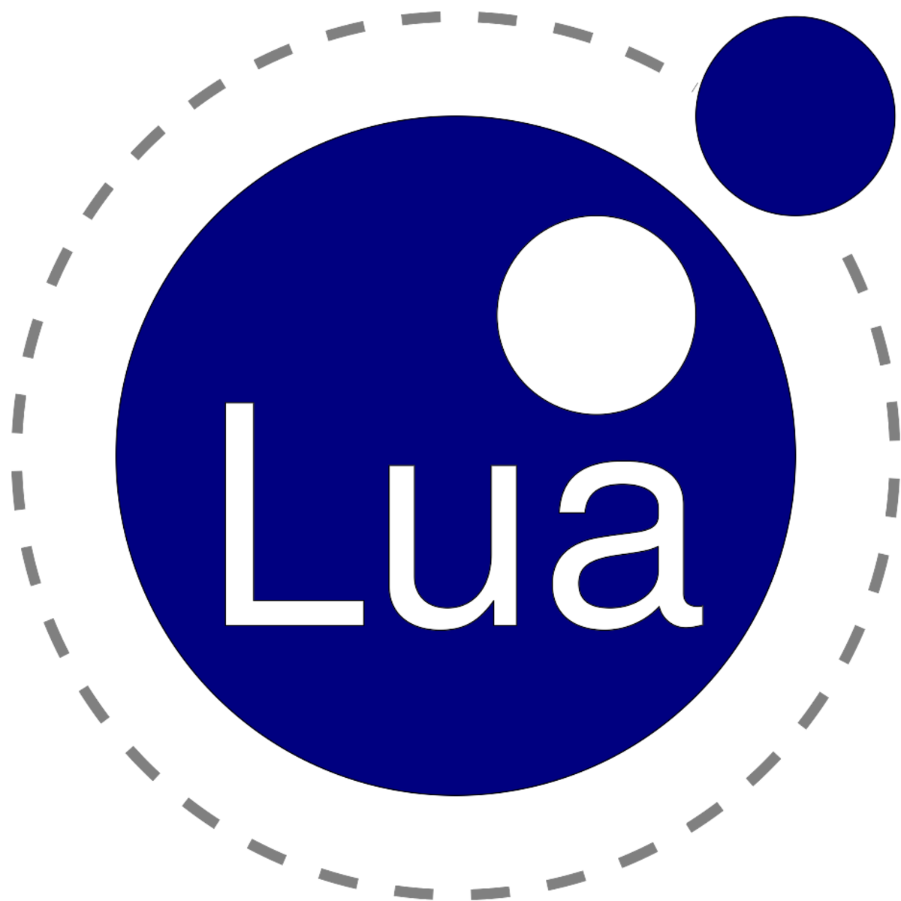

<h1 align="center">ConteudosTech🕹</h1>

### Seja bem vindo a ConteudosTech!

O objetivo desse repositório é compartilhar todo o conhecimento que um profissional que deseja trabalhar na area da tecnologia deve possuir, conhecimentos complementares que podem lhe auxiliar no dia a dia ou que sejam especificos para outras vagas.

1. [ConteudosTech](https://github.com/thundercowboy/ConteudosTech#ConteudosTech)
    - [Cursos](https://github.com/thundercowboy/ConteudosTech#Cursos)
    - [Livros](https://github.com/thundercowboy/ConteudosTech#Livros)
    - [IDES](https://github.com/thundercowboy/ConteudosTech#IDES)
    - [Linguagens](https://github.com/thundercowboy/ConteudosTech#linguagens)
1. [Contribuindo](https://github.com/thundercowboy/ConteudosTech#Contribuindo)

## Cursos

1.  Introdução/Lógica de Programação
    
Curso | Duração | Instrutor 
:---- | :----: | :----:
[Algoritmos](https://www.cursoemvideo.com/curso/curso-de-algoritmo/) | 40 horas | Gustavo Guanabara |
[Programação Orientada a Objetos I](https://pt.coursera.org/learn/lab-poo-parte-1) | 30 horas | Fabio Kon |

2.  Linguagens

- Python

Curso | Duração | Instrutor
:---- | :----: | :----:
[Introdução à Ciência da Computação com Python](https://www.coursera.org/learn/ciencia-computacao-python-conceitos) | 40 horas | Fabio Kon |
[Introdução à Ciência da Computação com Python II](https://pt.coursera.org/learn/ciencia-computacao-python-conceitos-2) | 30 horas | Fabio Kon |
[Python 3 - Mundo 1](https://www.cursoemvideo.com/curso/python-3-mundo-1/) | 40 horas | Gustavo Guanabara |
[Python 3 - Mundo 2](https://www.cursoemvideo.com/curso/python-3-mundo-2/) | 40 horas | Gustavo Guanabara |
[Python 3 - Mundo 3](https://www.cursoemvideo.com/curso/python-3-mundo-3/) | 40 horas | Gustavo Guanabara |
[Curso de Python 3 do Básico Ao Avançado](https://www.udemy.com/course/python-3-do-zero-ao-avancado/) | 140 horas | Luiz Otávio Miranda |

- C#
    
Curso | Duração | Instrutor
:---- | :----: | :----:
[C# COMPLETO Programação Orientada a Objetos + Projetos](https://www.udemy.com/course/programacao-orientada-a-objetos-csharp/) | 40 horas | Nelio Alves |
    
- Java
    
Curso | Duração | Instrutor
:---- | :----: | :----:
[Java COMPLETO Programação Orientada a Objetos +Projetos](https://www.udemy.com/course/java-curso-completo/) | 60 horas | Nelio Alves |

3.  Banco de Dados

Curso | Duração | Instrutor
:---- | :----: | :----:
[MySQL](https://www.cursoemvideo.com/curso/mysql/) | 40 Horas | Gustavo Guanabara |
[O curso completo de Banco de Dados e SQL, sem mistérios!](https://www.udemy.com/course/bancos-de-dados-relacionais-basico-avancado/) | 60 horas | Felipe Mafra |

## Livros
    
1. Introdução/Lógica de Programação
    
##### Algoritmos
    
Livro | Autor(es) | Linguagem
:---- | :----: | :----: |
[Algoritmos e Programação](https://www.ifmg.edu.br/ceadop3/apostilas/algoritmos-e-programacao) | Adolfo José G. S. Baudson |  |
[Algorithms](https://en.wikibooks.org/wiki/Algorithms) | Wikibooks |  |

2. Linguagens

##### Python

Livro | Autor(es) | Linguagem
:---- | :----: | :----: |
[Aprenda computação com Python](https://aprendendo-computacao-com-python.readthedocs.org/en/latest/index.html) | - |  |
[Pense em Python](https://penseallen.github.io/PensePython2e) | Allen B. Downey |  |
[20 Python Libraries You Aren't Using (But Should)](https://www.oreilly.com/learning/20-python-libraries-you-arent-using-but-should) | Caleb Hattingh | 
[A Beginner's Python Tutorial](https://en.wikibooks.org/wiki/A_Beginner%27s_Python_Tutorial) | Wikibooks | 
[Full Stack Python](https://www.fullstackpython.com) | Matt Makai | 
[How to Think Like a Computer Scientist: Learning with Python, Interactive Edition](https://runestone.academy/runestone/books/published/thinkcspy/index.html) | Brad Miller | 
[Python 101](https://python101.pythonlibrary.org) | Michael Driscoll | 
[Python 3 Official Documentation](https://docs.python.org/3/download.html) | Python Documentation | 

## IDES

"IDE é um acrônimo para 'Integrated Development Environment', que significa Ambiente de Desenvolvimento Integrado em português. Ele é um programa que reúne ferramentas necessárias para a construção de outros softwares."

<table>
  <tr>
    <td align="center"><a href="https://code.visualstudio.com/"> <b>VS Code</b></a> </td>
    <td align="center"><a href="https://www.jetbrains.com/idea/"> <b>INtelliJ IDEA</b></a> </td>
    <td align="center"><a href="https://eclipseide.org/"> <b>Eclipse</b></a> </td>
  </tr>
</table>

## Linguagens

* Assembly

<tr>
    <h1 align="center"></h1>
</tr>

C é uma das linguagens de programação mais populares e existem poucas arquiteturas para as quais não existem compiladores para C. C tem influenciado muitas outras linguagens de programação (por exemplo, a linguagem Java), mais notavelmente C++, que originalmente começou como uma extensão para C.

Ano | Tipagem | Bom para: |
:---- | :----: | :----:
1972 | Estática / Fraca | Embarcados; Jogos |

* C#

* C++

* Java

* JavaScript (JS)

<tr>
    <h1 align="center"></h1>
</tr>

Lua foi criada por um time de desenvolvedores do Tecgraf da PUC-Rio, a princípio, para ser usada em um projeto da Petrobras. Devido à sua eficiência, clareza e facilidade de aprendizado, passou a ser usada em diversos ramos da programação, como no desenvolvimento de jogos (a Blizzard Entertainment, por exemplo, usou a linguagem no jogo World of Warcraft), controle de robôs, processamento de texto, etc. Também é frequentemente usada como uma linguagem de propósito geral.

Ano | Tipagem | Bom para: |
:---- | :----: | :----:
1993 | Dinâmica / Forte | Estender aplicações; Jogos |

* Perl

* PHP

* Python

* R

* Ruby

* Swift

## Contribuindo
    
Contribuições são sempre encorajadas e bem vindas! Apoie este projeto! 🚀

Regras sobre [Como Contribuir](https://github.com/thundercowboy/ConteudosTech/blob/main/contribuindo.md).
